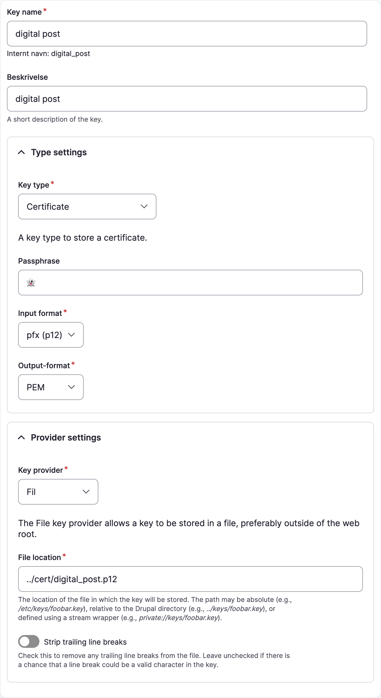
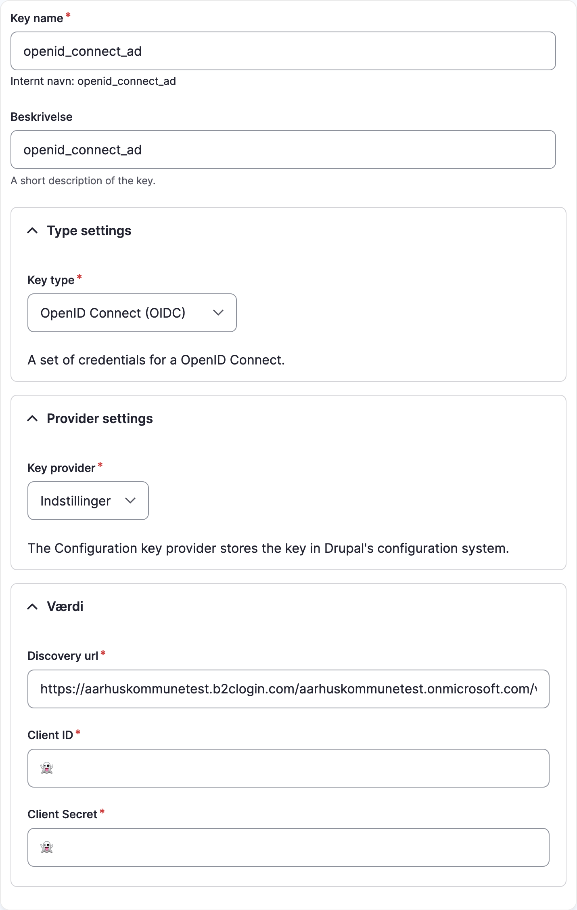

# OS2Web key

Key types and providers for OS2Web built on the [Key module](https://www.drupal.org/project/key).

The OS2Web key module provides two _key types_, [Certificate](#certificate) and [OpenID Connect
(OIDC)](#openid-connect-oidc). Two _key providers_, [Azure Key Vault](#azure-key-vault) and [Infisical](#infisical), are
planned, but not yet implemented.

See [the Key Developer Guide](https://www.drupal.org/docs/contributed-modules/key/developer-guide) for details in how to
use keys in Drupal.

## Installation

``` shell
composer require os2web/os2web_key
drush pm:install os2web_key
```

Keys are managed on `/admin/config/system/keys`.

## Key types

### Certificate

This key type handles [PKCS 12](https://en.wikipedia.org/wiki/PKCS_12) or [Privacy-Enhanced Mail
(PEM)](https://en.wikipedia.org/wiki/Privacy-Enhanced_Mail) certificate with an optional password (passphrase).

Managing the key:



Use in a form:

``` php
$form['key'] => [
 '#type' => 'key_select',
 '#key_filters' => [
   'type' => 'os2web_key_certificate',
 ],
];
```

The [`KeyHelper`](https://github.com/OS2web/os2web_key/blob/main/src/KeyHelper.php) can be used to get
the actual certificates (parts):

``` php
<?php

use Drupal\os2web_key\KeyHelper;
use Drupal\key\KeyRepositoryInterface;

// Use dependency injection for this.
/** @var KeyRepositoryInterface $repository */
$repository = \Drupal::service('key.repository');
/** @var KeyHelper $helper */
$helper = \Drupal::service(KeyHelper::class);

// Use `drush key:list` to list your keys.
$key = $repository->getKey('my_key');
[
  // Passwordless certificate.
  CertificateKeyType::CERT => $certificate,
  CertificateKeyType::PKEY => $privateKey,
] = $helper->getCertificates($key);

```

**Note**: The parsed certificate has no password.

### OpenID Connect (OIDC)

Managing the key:



Example use in a form:

``` php
$form['key'] => [
 '#type' => 'key_select',
 '#key_filters' => [
   'type' => 'os2web_key_oidc,
 ],
];
```

Get the OIDC config:

``` php
<?php

use Drupal\key\KeyRepositoryInterface;
use Drupal\os2web_key\Plugin\KeyType\OidcKeyType;

// Use dependency injection for this.
/** @var KeyRepositoryInterface $repository */
$repository = \Drupal::service('key.repository');

$key = $repository->getKey('openid_connect_ad');
[
  OidcKeyType::DISCOVERY_URL => $discoveryUrl,
  OidcKeyType::CLIENT_ID => $clientId,
  OidcKeyType::CLIENT_SECRET => $clientSecret,
] = $helper->getOidcValues($key);
```

## Providers

### Azure Key Vault

`@todo` <https://azure.microsoft.com/en-us/products/key-vault>

### Infisical

`@todo` <https://infisical.com/>

## Coding standards

Our coding are checked by GitHub Actions (cf. [.github/workflows/pr.yml](.github/workflows/pr.yml)). Use the commands
below to run the checks locally.

### PHP

```shell
docker run --rm --volume ${PWD}:/app --workdir /app itkdev/php8.3-fpm composer install
# Fix (some) coding standards issues
docker run --rm --volume ${PWD}:/app --workdir /app itkdev/php8.3-fpm composer coding-standards-apply
# Check that code adheres to the coding standards
docker run --rm --volume ${PWD}:/app --workdir /app itkdev/php8.3-fpm composer coding-standards-check
```

### Markdown

```shell
docker run --rm --volume $PWD:/md peterdavehello/markdownlint markdownlint --ignore vendor --ignore LICENSE.md '**/*.md' --fix
docker run --rm --volume $PWD:/md peterdavehello/markdownlint markdownlint --ignore vendor --ignore LICENSE.md '**/*.md'
```

## Code analysis

We use [PHPStan](https://phpstan.org/) for static code analysis.

Running static code analysis on a standalone Drupal module is a bit tricky, so we use a helper script to run the
analysis:

```shell
docker run --rm --volume ${PWD}:/app --workdir /app itkdev/php8.3-fpm ./scripts/code-analysis
```
